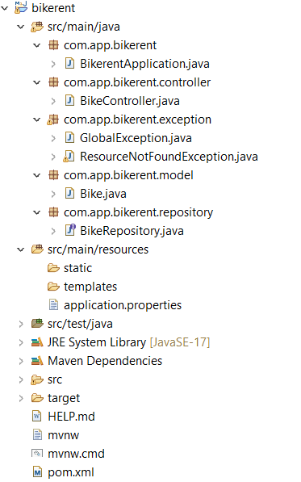
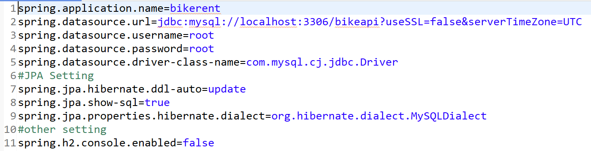
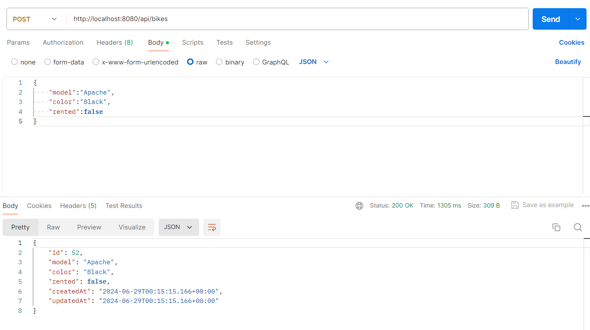
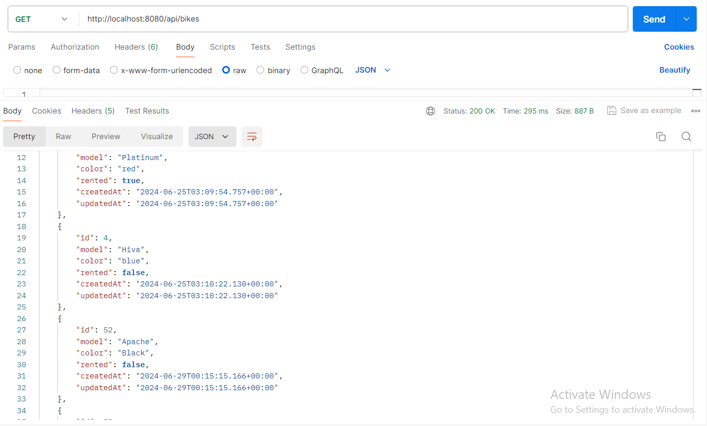
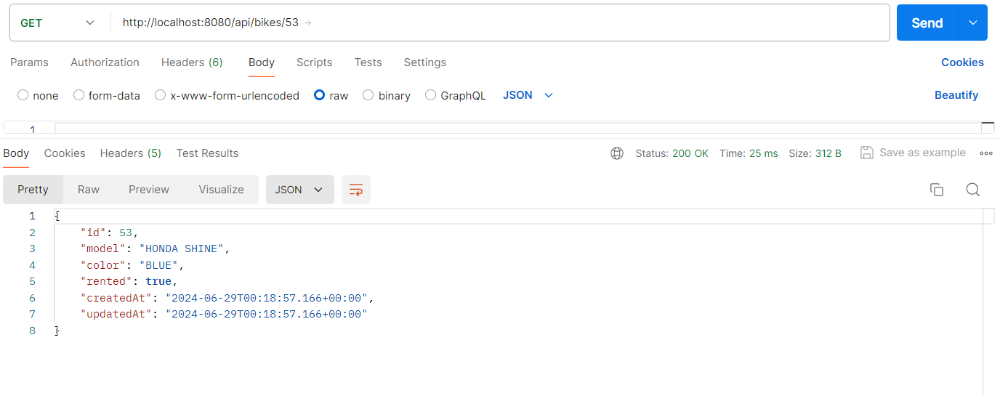

<h1>About This Program</h1>

This is a simple REST API for Bike Rental Service created using  Spring Boot. It includes
<ul>
  <li>Adding Bike Information, including rental status.</li>
  <li>Fetching Information Of All Bikes.</li>
  <li>Fetching Information Of A Particular Bike.</li>
  <li>Updation Bike Information.</li>
  <li>Deleting Bike Information.</li>
</ul>
  Methods, End Points And Description Are Given Below.

<h1>API KEYS</h1>

<table>
<r>
  <th><h3>METHOD</h3></th>
   <th><h3>ENDPOINT</h3></th>
  <th><h3>DESCRIPTION</h3></th>
</r>
<tr>
<td>POST</td>
<td>http://localhost:8080/api/bikes</td>
<td>User Can Add New Bike Information.</td>
</tr>
<tr>
<td>GET</td>
<td>http://localhost:8080/api/bikes</td>
  <td>Fetch All The Bike Information.</td>
</tr>
  <tr>
<td>GET</td>
<td>http://localhost:8080/api/bikes/{id}</td>

 <td>Fetch Information Of A Particular Bike Using ID.</td>
</tr>
<tr>
<td>PUT</td>
<td>http://localhost:8080/api/bikes/{id}</td>
  <td>Update Information Of A Particular Bile Uding ID.</td>
</tr>
<tr>
<td>DELETE</td>
<td>http://localhost:8080/api/bikes/{id}</{id}td>
  <td>Delete The Bike Information Using ID.</td>
</tr>
  
</table>

<h1>FOLDER STRUCTURE</h1>

<h1>Application Properties Configuration</h1>
FOR MYSQL

<h1>ADDING NEW BIKE INFORMATION USING POST METHOD</h1>

<h1>DISPLAYING ALL THE BIKE INFORMATION USING GET METHOD</h1>

<h1>DISPLAYING PARTICULAR BIKE INFORMATION BY ID  USING GET METHOD</h1>

<h1 style="color:red;">Rahul Kumar Yadav</h1>
